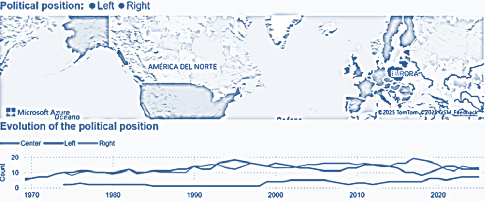

# TFM - Geopolitical Trend in Real Time from News

## Author

  * Maria Roser Santacreu Gou - [msantacreugo@uoc.edu](msantacreugo@uoc.edu)
  * Assignatura: M2.978 / Semestre: 2024-2 / Data: 01-06-2025

## Key Words

* Natural Language Processing (NLP)
* Big Data Analysis in Streaming (BDA in Streaming)
* Machine Learning (ML)

## Abstract

Nowadays with Big Data and new technologies, the following saying should no longer make sense:

"Man is the only animal that trips twice over the same stone"

If this is interpreted as the humanity cannot remember everything learned or the history that precedes us, then in the same situations same mistakes will be repeated.
Therefore, if the evolution of news from different media and countries are analysed, can one predict the future and avoid trips again?

In this point, this work is based on the population’s concerns extraction of different countries, using the news reports from various media sources, in conjunction with the old election results of some countries, and by applying through NLP, real-time analysis, and ML, the election results will be predicted.

Since election results will not be available for many countries, countries will be grouped according on their similarity concerns in a specific time periods, and the model trained in similar country will be applied in these similar countries to predict next elections results. This step includes the difficulty of dealing with different languages in which we will receive the news; so all news will be translated into English during ingestion.

Additionally, grouping countries by similar concerns provides to the finally user the opportunity to view additional information, allowing them to observe and delve deeper into the differences in specific topics across countries and reflect on how they fixed them doing an additional research. For example, if one country doesn’t have school absences and ours does, this fact leads to further investigation into how it was resolved.

While the primary goal is to predict election results, visualizing time series of the main concerns of different countries, at different granularities of periods, provides a trajectory of the countries' evolution. And this can be very relevant, offering valuable insights that enable learning and anticipating the future in similar early-stage situations.

## Repository description

The files contained in this repository are the following:

* `Documentation - index.html`: Direct access to Doxygen documentation.
* `memoria.pdf`: Memory of the Master's Final Project.
* `get_old_news_us.py`: Download old news from API New York Times save on local and also in hdfs an proces them using nlp.
* `main.py`: Download all last news (only yesterday news because API are free) from countries defined and send to producer. When finish, starts consumer and pre-process them, after some time till none received any msg finish consumer and start natural language to process last news non processed. Finally get and update prediction with last news processed, from last appointment president from each country to today, and save results.
* `set_environment.sh`: Instructions to set up the environment on a single PC.
* `train_model.py`: Train the Logistic Regression, and Naive Bayes prediction model as a base, with old news from the New York Times from the last 50 years.
* `/source/classification_news.py`: Pretrained model DistilBert For Sequence Classification to classification news.
* `/source/constants.py`: Constants used in the project, can be modified by the user to adapt the execution of the project to their requirements.
* `/source/consumer_news.py`: Consume news from kafka topic, precese them and save to hdfs. Classify news with Pretrained model getting summary concerns.
* `/source/get_dataset.py`: Prepare the datasets that combines features and labels, for each day of each country news.
* `/source/get_news.py`: Download news from both API for all countries in iso codes list, save them into each county file as csv, and call producer to send news into broker.
* `/source/load_old_news_hdfs.py`: Load old news into Hadoop's distributed system files, in parquet format, also classify news with Pretrained model getting summary concerns
* `/source/nlp_news.py`: Process news using NLP for model training and prediction, as well as for use in Power BI visualization.
* `/source/predict.py`: Predict the political position of each country's news from the last date of appointment of the president to today.
* `/source/producer_news.py`: Contains functions to initialize producer, send message to a topic, and make records immediately available.
* `/source/translate.py`: Translate text to english as default, using google translate requests.

* `/data/paisos-ue.csv`: CSV file containing the ISO codes of each country in the European Union (including the United Kingdom), and the ISO codes of the languages ​​used in each country.
* `/data/pais-us.csv`: Fitxer CSV que conté els codi ISO dels Estats Units, i els codis ISO de les llengües que fan servir.
* `/data/president/presidents-**.csv`: Files with presidents since approximately 1970, of each country ** (ISO country code), with the name, date of appointment, and political position of which they belonged or belong.

## Project configuration for execution

1. Set up the environment and start the services by following the instructions in the file:
    
    `set_environment.sh`

2. Tot seguit s’ha de obtenir les key  de les diferents API, donar-se dalta a cada una, i intercanviar les key en el fitxer de `constants.py` file.

* `NEWS_API_KEY` : Key for downloading current news from the United States. https://newsapi.org.
* `NEWS_DATA_IO_KEY` : Key for downloading current news from European Union member countries.. https://newsdata.io .
* `NEWS_NY_TIME_KEY` : Key for downloading historical news from the United States via the New York Times. https://api.nytimes.com

3. The next file contains the values ​​of; timeouts, file and directory names, and configurations among others, which can be modified by the user to adapt the execution of the project to their requirements. The current values ​​of these constants have been configured based on the objectives and needs of the project.

    `constants.py`

4. Now you can start downloading the old data by running the file:

    `get_old_news_us.py`

5. Once the download process is complete, you can start training the model by executing the file:

    `train_model.py`

6. Finally, once we have the model trained, we can start the daily download of the news, where they are treated and injected into the topic of producer, consumer, processing, classification and prediction, a process that never ends and that automatically repeats itself every 24 hours.

    `main.py`

7. At this point the visualization in Power BI is ready to capture the daily data and display it, the model extracts the data from Ubuntu '/data/cleaned/', although the path of the dataset from Power Query will have to be updated, for example for concerns_summary.csv file its source is: `(Origen = Csv.Document(File.Contents("\\wsl.localhost\Ubuntu\home\roser\TFM\data\cleaned\concerns_summary.csv"))`

    `Geopolitical Trend in Real Time.pbix`

## Presentation video

Link to the Master's Final Project presentation video: 
